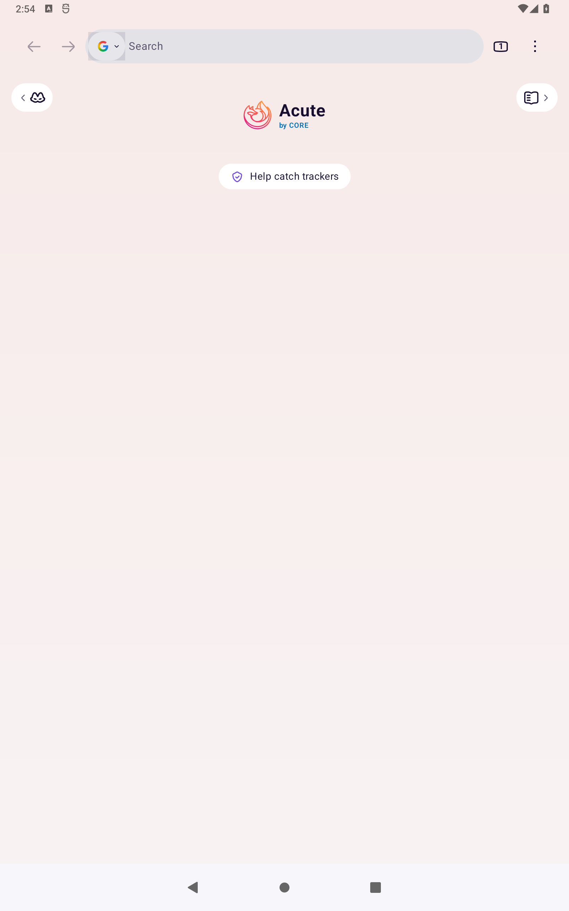

# Acute Web for Android

<p align="center">
  
</p>

**Acute Web by CORE** is a privacy-focused Android browser built on Mozilla's
open-source Gecko engine. It is distributed directly as a signed, sideloadable
APK for ARM64 phones, tablets, foldables, and ChromeOS devices.

[Website](https://acute.iiankehn.com/) ·
[Download the latest release](https://github.com/iiankehn/acute-web-android/releases/latest) ·
[Report an issue](https://github.com/iiankehn/acute-web-android/issues/new/choose)

## Highlights

- Tabs and a unified search/address bar
- Bookmarks, history, downloads, saved passwords, and private browsing
- Support for compatible browser extensions
- Tablet layouts, desktop-site defaults, split-screen support, and
  keyboard/mouse-friendly controls
- Built-in update checks against signed releases from this repository
- Acute telemetry, diagnostic reporting, and crash uploads disabled
- Direct issue reporting through GitHub

## Acute on Android

<p align="center">
  
</p>

*Acute Web 0.3 running on the Android 12 tablet test profile.*

## Supported devices

Current releases target **ARM64 (arm64-v8a)** devices running **Android 8.0 or
newer**. Android 12 is included in the automated launch and rotation test
matrix. Large-screen behavior is documented in
[Tablet support](docs/TABLET_SUPPORT.md).

Acute Web is not distributed through Google Play. Installations and updates use
the signed APKs published on the
[Releases page](https://github.com/iiankehn/acute-web-android/releases).

## Updates

Acute checks GitHub Releases for a newer stable version at most once every six
hours. When an update is available, the app presents the release and hands the
signed APK to Android's package installer. Android will accept an upgrade only
when its signing certificate matches the installed version.

The updater does not silently install software and does not bypass Android's
installation controls.

## How the project is built

This repository contains the Acute source overlay, product resources, tests,
and release automation. Release builds use a reviewed, pinned Mozilla source
commit, apply Acute's changes, run validation and Android smoke tests, and sign
the resulting APK in an isolated GitHub Actions job.

Mozilla source is not vendored into this repository. Keeping the Acute changes
separate makes the product-specific work reviewable while allowing deliberate
upstream security updates.

## Build from source

Linux is the supported build host; WSL 2 can be used on Windows. The first build
downloads a large toolchain and source tree.

```bash
git clone https://github.com/mozilla-firefox/firefox.git
git clone https://github.com/iiankehn/acute-web-android.git
cd firefox
python3 ./mach bootstrap --application-choice mobile_android_artifact_mode --no-interactive
../acute-web-android/scripts/apply_overlay.py .
./mach gradle fenix:assembleDebug
```

The debug APK is written beneath the Firefox object directory at
`gradle/build/mobile/android/fenix/app/outputs/apk/debug/`.

For release operations, see:

- [Repository and release setup](docs/GITHUB_SETUP.md)
- [APK signing](docs/SIGNING.md)
- [Maintaining the Gecko/Firefox source base](docs/UPSTREAM.md)
- [Contributing](CONTRIBUTING.md)
- [Security policy](SECURITY.md)

## Project status

Acute Web is under active development. Version 0.3 establishes the Acute Web by
CORE identity, privacy defaults, update path, and Android phone/tablet
experience. Bug reports and reproducible device feedback are welcome through
[GitHub Issues](https://github.com/iiankehn/acute-web-android/issues).

## Licensing and attribution

Acute Web is developed by CORE using Mozilla's open-source Gecko and Firefox
for Android code. Source files derived from Mozilla retain their original
copyright notices and licensing terms. This repository is available under the
[Mozilla Public License 2.0](LICENSE).

Firefox and Mozilla are trademarks of the Mozilla Foundation. Acute Web is an
independent project and is not endorsed by or affiliated with Mozilla.
